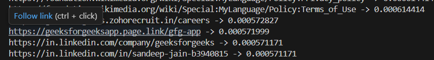

# Web Crawler with PageRank (C++)

## Project Overview
This project is a **basic web crawler** implemented in **C++** that downloads a webpage, extracts hyperlinks, stores link relationships in a database, and computes **PageRank scores** for the discovered pages.

The project demonstrates how real-world search engines begin by crawling webpages and ranking them based on link structure.

---

## Objectives
- Download HTML content from a given URL
- Extract hyperlinks from the webpage
- Store page-to-page relationships (edges) in a database
- Apply the **PageRank algorithm** to rank pages
- Understand real-life applications of **graphs and algorithms**

---

## Technologies Used
- **C++**- Programming language used
- **libcurl** – for downloading webpages
- **SQLite3** – for storing link relationships
- **CMake** – for build automation
- **Linux / WSL**

---
## Output Screenshots
### Extracted links from webcrawling

### Crawling GeeksforGeeks

### PageRank Results

